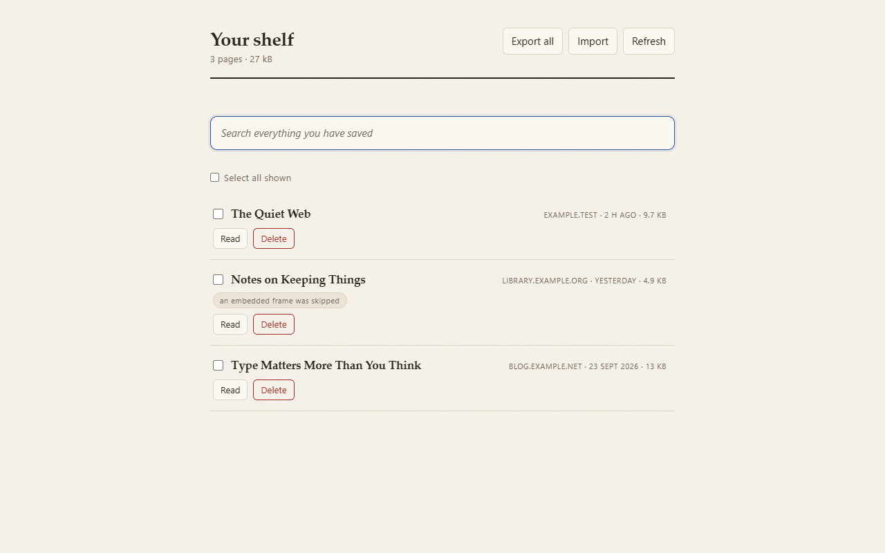
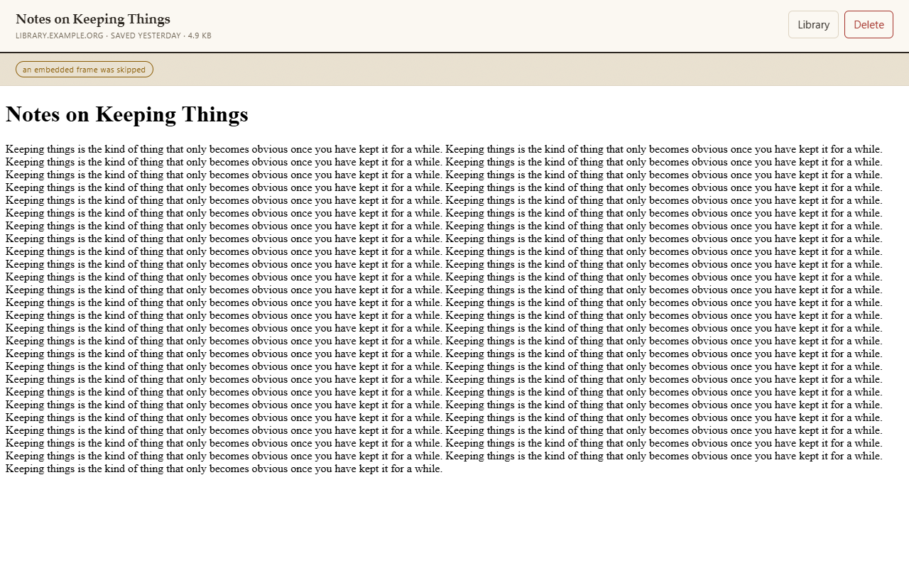
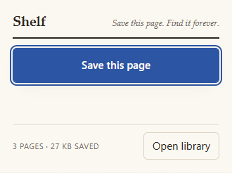

# Shelf

**Save any page. Find it forever.** Shelf keeps a complete, readable copy of the page you are on - on
your machine, not on a server - and makes everything you have saved searchable in one place.



- **One click.** The page you are reading is saved as it looked, including the parts that usually do
  not survive a copy: the rendered DOM, the stylesheets, the images.
- **Instant local search.** Full text over everything you have saved, ranked, offline.
- **Read it offline.** Archived pages open in a sandboxed reader: no scripts run, nothing is fetched.
- **Yours.** No account, no sync service, no telemetry. The whole archive exports as one JSON file - or
  just the pages you tick - and importing that file back is idempotent: the same file twice is the same
  library, not two.
- **Pocket refugees welcome.** Pocket exports, browser bookmarks and saved pages (SingleFile) all
  import. Bookmarks and Pocket links come in as exactly what they are - addresses, with their titles
  and tags, marked "the page itself was not in that file" - and saved pages come in as full pages,
  cleaned the same way a live save is.

| The reader | The popup |
| --- | --- |
|  |  |

Dark mode is ink, not a grey inversion - the set is in [`docs/screenshots/`](docs/screenshots/)
(light and dark, shot from the real extension by `scripts/screenshots.mjs`).

## Status

v0.1.0 - the first release, and it works: capture, library, ranked search, the sandboxed reader,
selected-export, and imports for Pocket/bookmarks/SingleFile. 170 unit tests and 38 end-to-end tests
(the real extension, in a real browser, against a site Shelf does not own) run on every push, on
Windows and Linux. Store listings are in progress; the store copy and per-store notes live in
[`docs/STORE-LISTING.md`](docs/STORE-LISTING.md).

## Install

The [Releases page](https://github.com/Caseymccallum/shelf/releases) has the built packages and their
SHA-256 checksums.

- **Chrome / Edge** - download `shelf-<version>-chrome.zip`, unzip it, then open `chrome://extensions`
  (or `edge://extensions`), turn on Developer mode, and **Load unpacked** pointing at the unzipped
  folder.
- **Firefox** - `shelf-<version>-firefox.zip` installs permanently on Developer Edition / Nightly
  (with `xpinstall.signatures.required` off); on release Firefox it loads temporarily via
  `about:debugging` → This Firefox → Load Temporary Add-on.

Or build it yourself: `npm ci && npm run build`, then load `.output/chrome-mv3`.

## Why it exists

Read-it-later services die. Pocket was discontinued on 8 July 2025, after nineteen years, and took
its users' libraries with it. Bookmarks do not preserve anything - they rot. Every serious
alternative that keeps a *library* asks you to run a server (Linkwarden, Karakeep, Wallabag) or
trusts somebody else's cloud. Shelf's argument is that a library you cannot lose is a directory of
files you own, with a search index beside it.

## Development

```bash
npm install
npm run dev        # Chrome, with live reload
npm run verify     # typecheck, unit tests, build
npm run test:e2e   # saves real fixture pages in a real browser and reads them back
```

Documentation lives in [`docs/ARCHITECTURE.md`](docs/ARCHITECTURE.md) (how it is built and why,
including the decision record) and [`docs/FORMAT.md`](docs/FORMAT.md) (the archive format).

## Licence

MIT
